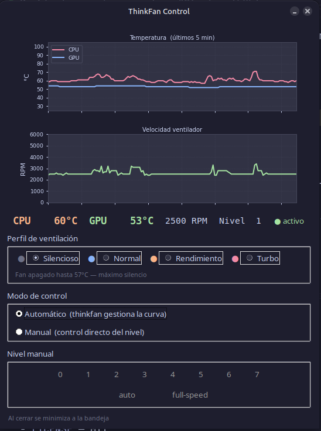

# ThinkPad Fan Control

A graphical fan speed monitor and controller for Lenovo ThinkPad laptops running Linux.


## Features

- **Real-time graphs** — temperature (CPU + GPU) and fan RPM history (last 5 minutes)
- **4 fan profiles** — switch instantly between Silencioso, Normal, Rendimiento, and Turbo
- **System tray** — runs in the background with a color-coded tray icon (green/orange/red)
- **Auto + Manual modes** — let thinkfan manage the curve or take direct control (levels 0–7, auto, full-speed)
- **Profile persistence** — remembers your last profile across reboots
- **Auto-start** — launches silently at login

## Screenshots



## Requirements

- Lenovo ThinkPad with `thinkpad_acpi` kernel module
- Linux (tested on Linux Mint 22.3 Cinnamon, kernel 6.17)
- Python 3.8+

## Installation

```bash
git clone https://github.com/srne0/thinkpad-fan-control.git
cd thinkpad-fan-control
bash install.sh
```

The installer automatically:
1. Detects your distro (`apt` / `dnf` / `pacman` / `zypper`) and installs dependencies
2. Enables `thinkpad_acpi fan_control=1` permanently
3. Installs a minimal `sudo` helper for privileged fan operations
4. Writes a default `thinkfan` config
5. Enables and starts the `thinkfan` systemd service
6. Creates an app menu entry and autostart entry

### Wayland / Hyprland

The app works on Wayland. For the system tray icon you need a tray-compatible bar:

- **waybar** — add `"tray"` to your `modules-right` in `~/.config/waybar/config`
- **swaybar**, **ironbar**, **ags** — any AppIndicator-compatible tray works

The installer detects waybar and offers to add the tray module automatically.

If no tray is available, the app launches as a normal window.

## Profiles

| Profile | Fan activates at | Best for |
|---------|-----------------|----------|
| **Silencioso** | 57°C CPU | Light work, reading, video |
| **Normal** | 50°C CPU | Everyday use |
| **Rendimiento** | 43°C CPU | Compilation, sustained workloads |
| **Turbo** | 38°C CPU | Gaming, benchmarks, max cooling |

Switching profiles in Auto mode immediately rewrites `/etc/thinkfan.conf` and reloads the service.

## Supported Distros

| Distro | Package Manager | Status |
|--------|----------------|--------|
| Ubuntu / Linux Mint | apt | Tested |
| Fedora | dnf | Should work |
| Arch Linux | pacman | Should work |
| openSUSE | zypper | Should work |

## How It Works

```
thinkfan-control.py  (GUI)
        │
        │  reads temps/RPM
        ▼
/sys/class/hwmon/      /proc/acpi/ibm/fan
(thinkpad_acpi hwmon)

        │
        │  sudo /usr/local/bin/thinkfan-set-level
        ▼
/etc/thinkfan.conf  ──▶  thinkfan.service
```

The GUI never writes system files directly. All privileged operations go through a minimal helper script (`thinkfan-set-level`) allowed via a `/etc/sudoers.d/thinkfan-gui` rule — no password prompt.

## Uninstall

```bash
bash install.sh --uninstall
```

Or manually:

```bash
sudo systemctl disable --now thinkfan
sudo rm /usr/local/bin/thinkfan-set-level
sudo rm /etc/sudoers.d/thinkfan-gui
sudo rm /etc/modprobe.d/thinkpad.conf
rm -rf ~/.local/share/thinkpad-fan-control
rm ~/.local/share/applications/thinkfan-control.desktop
rm ~/.config/autostart/thinkfan-control.desktop
rm -rf ~/.config/thinkfan-gui
```

## Dependencies

| Package | Purpose |
|---------|---------|
| `thinkfan` | Fan curve daemon |
| `python3-tk` | GUI toolkit |
| `python3-matplotlib` | Temperature / RPM graphs |
| `python3-pil` | Tray icon rendering |
| `python3-pystray` | System tray integration |
| `python3-gi` | GLib main loop (required for tray on Linux) |

## License

MIT — see [LICENSE](LICENSE)
